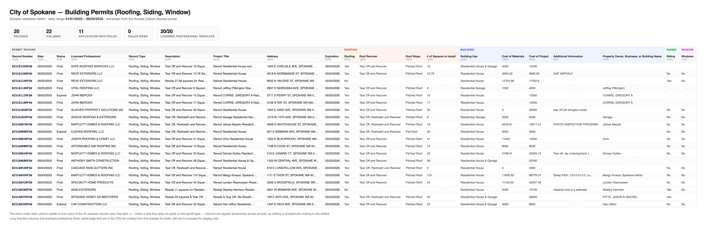

# Spokane Accela Permit Portal — Sample Extract

Validation batch for the City of Spokane **Accela Citizen Access** permit scrape.
Record type **Roofing, Siding, Window**, date range **01/01/2025 – 09/25/2025**.

**20 records · 22 columns · 0 failures.**

---

## What's here

| File | What it is |
|---|---|
| `sample_output.csv` | The 20-record sample batch, exactly as the pipeline produced it |
| `sample_run.log` | Unedited console output from the run that produced that CSV |
| `sample_preview.png` | The CSV rendered as a table, for quick review |

## What the sample demonstrates

**Every field in the spec is captured.** Record Number, Date, Status, Record Type and
Description come off the results grid; **Licensed Professional** is pulled from each
record's own detail page and sits immediately after Status, as requested. Address,
Project Title and Expiration come along for free.

**Application Information is extracted in full and aligned dynamically.** Across just
these 20 records the portal exposes **11 distinct** Application Information fields, and
which ones appear depends on the permit. The pipeline collects every field it encounters,
unions them into one header, and leaves a cell blank where a field doesn't apply to that
record — so a siding permit and a roofing permit line up correctly in the same sheet
instead of shifting columns. Fields are namespaced by their section (`ROOFING`,
`BUILDING`, `SIDING`, `WINDOW`) because the portal reuses short labels across sections.
Nothing is dropped.

**Licensed Professional resolved on 20/20** in this batch. Where a permit genuinely has no
licensed professional, the cell is left blank and the row is still kept — verified against
a real record with no contractor on file.

**Reliability is built in.** Requests are throttled to 1–2 seconds. A failed page is
retried twice; a third failure is written to a separate failures file with the record
number and the error, and the run continues rather than halting. Re-running against an
existing output file skips record numbers already present, so a re-run tops up the sheet
instead of duplicating it — verified by a second pass that added exactly 5 new records to
these 20 with 0 duplicates.

## Scale

The full 01/01/2025 – 09/25/2025 range holds roughly **2,300 records** — confirmed
directly against the portal, consistent with the ~2,400 estimate in the brief. The whole
range is reachable in a single query; no splitting the date range into chunks is needed.
A complete run takes on the order of **1.5 hours** at the throttle above.

## Notes on approach

The portal is an ASP.NET application sitting behind a commercial bot-protection layer,
which rules out the naive approach of replaying form state with a plain HTTP client — the
search request is rejected outright. Getting a search to run reliably takes a genuine
browser session; the per-record detail pages are then retrieved over a much cheaper path,
which is what keeps a 2,300-record run to ~1.5 hours instead of many.

Two details worth flagging, both found by testing against the live site:

- The column positions given in the brief don't match the live grid (Status is the 10th
  column, not the 4th). Columns are resolved by their header text rather than position, so
  the output stays correct even if the agency reorders the grid.
- The "expand More Details, then expand Application Information" step isn't actually
  needed — those values are already present in the page the portal serves. Removing that
  click sequence takes out the most fragile part of the workflow.

Output is CSV, which imports into Google Sheets directly. Writing to a Sheet automatically
is a small addition if preferred.

---

*Data shown is public record, published by the City of Spokane via its Citizen Access
portal. Full working code is available on engagement.*
